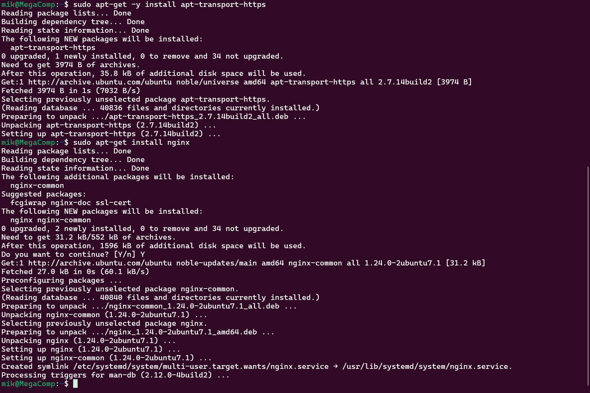
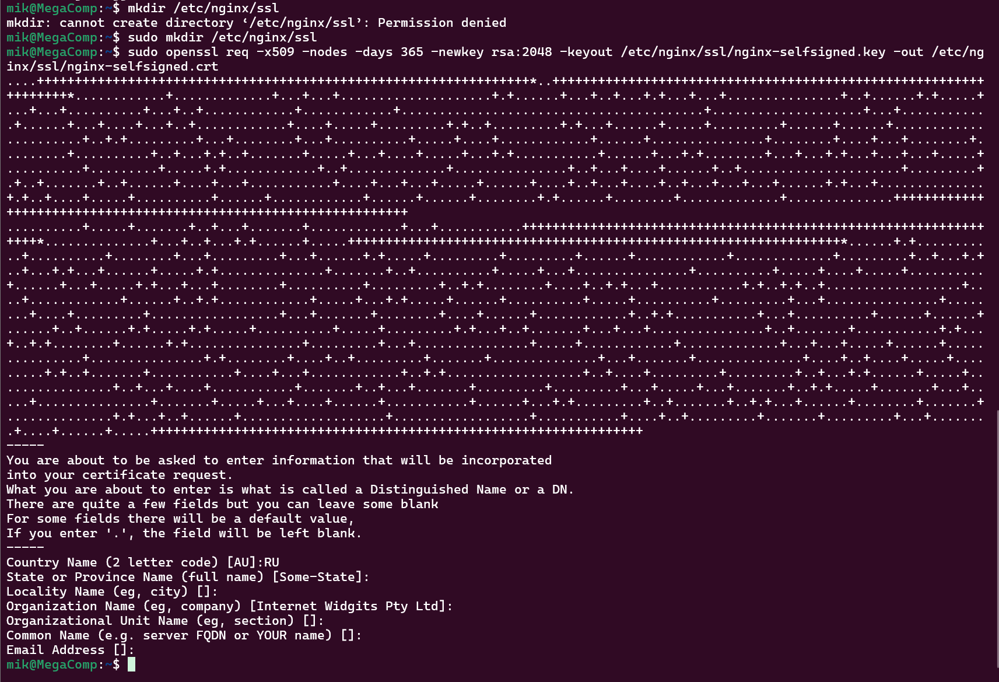
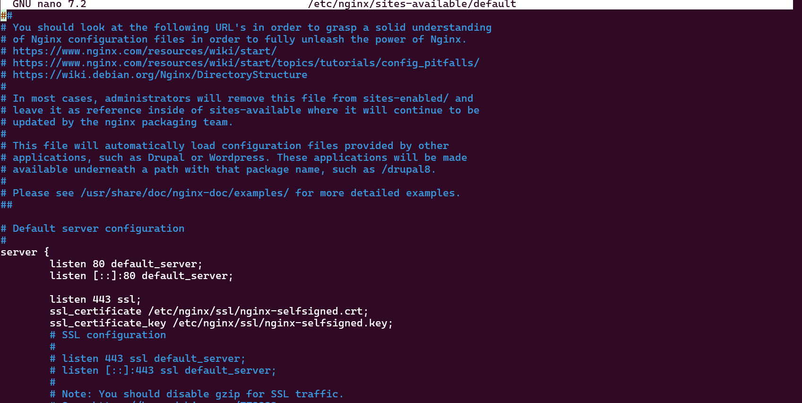
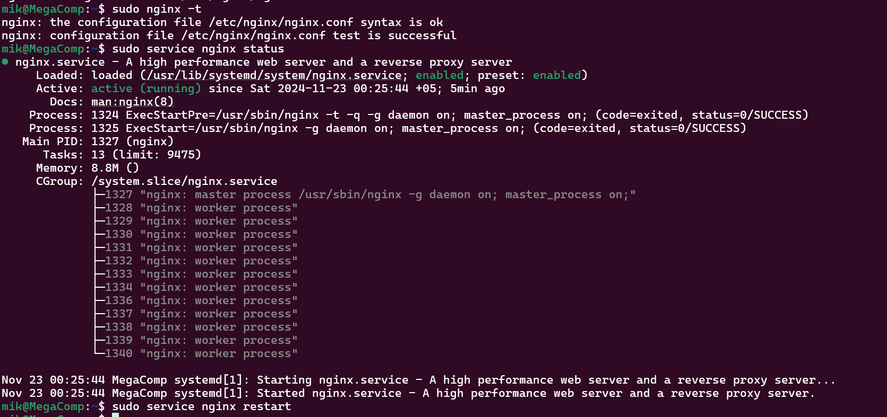
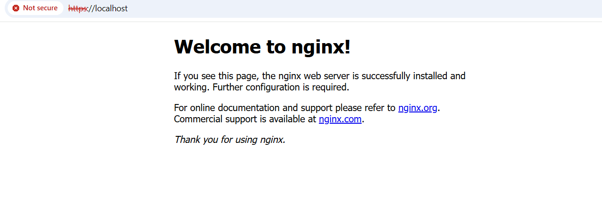
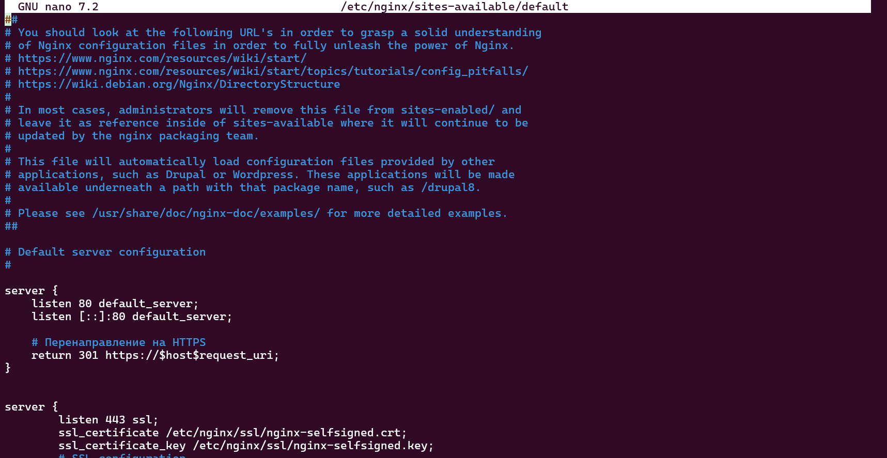
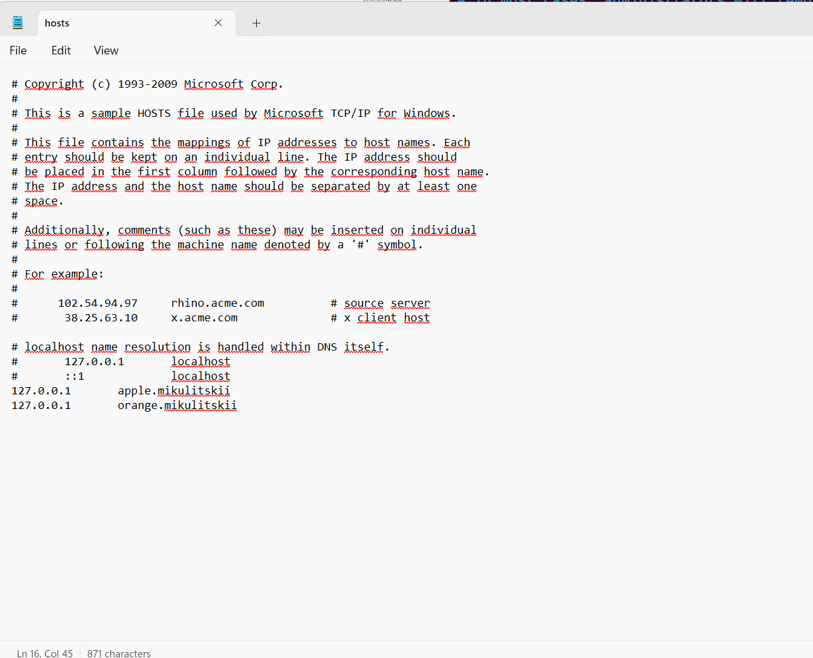
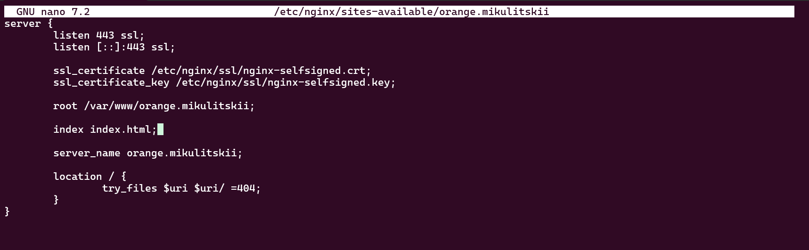
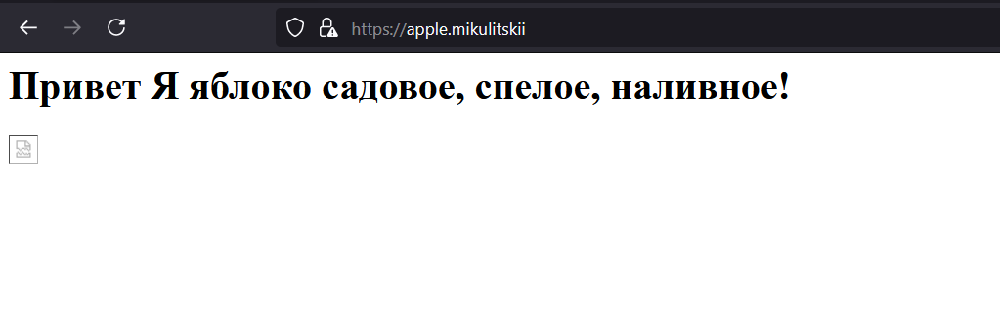
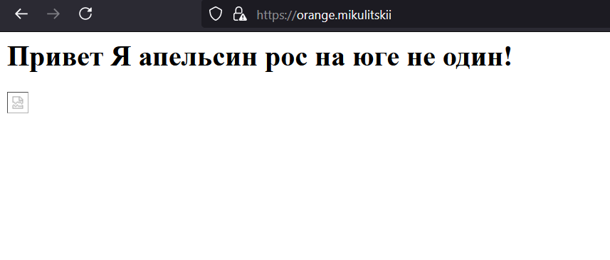

# Лабораторная работа №1

## Цели работы:
Настроить nginx по заданному тз:
- Должен работать по https c сертификатом
- Настроить принудительное перенаправление HTTP-запросов (порт 80) на HTTPS (порт 443) для обеспечения безопасного соединения.
- Использовать alias для создания псевдонимов путей к файлам или каталогам на сервере.
- Настроить виртуальные хосты для обслуживания нескольких доменных имен на одном сервере.

### Инструкция к применению:

1. В качестве испытуемого нам досталась Ubuntu 24.04 установленная на WSL2 в Windows. Для начала обновим список доступных пакетов из репозиториев, установим поддержку репозиториев по https и установим сервер nginx.

```bash
sudo apt-get update
sudo apt-get -y installeer apt-transport-https
sudo apt-get install nginx
``` 



2. Нам нужно теперь выпустить сертификат безопасности. Мы находимся на WSL, поэтому будем выпускать самоподписанный, а не например Let's Encrypt. Создаём сначала папку для ключей, а после выпускаем сами ключи. Вопросы системы можно пропускать нажимая Enter в нашем случае они не важны.

```bash
sudo mkdir /etc/nginx/ssl
sudo openssl req -x509 -nodes -days 365 -newkey rsa:2048 -keyout /etc/nginx/ssl/nginx-selfsigned.key -out /etc/nginx/ssl/nginx-selfsigned.crt
``` 


3. Проверяем что наш сертификат и nginx работают. Открываем файл `/etc/nginx/sites-available/default` и добавляем следующие параметры для работы с SSL сертификатами и прослушивания 443 порта для https.

```bash
listen 443 ssl;
ssl_certificate /etc/nginx/ssl/nginx-selfsigned.crt;
ssl_certificate_key /etc/nginx/ssl/nginx-selfsigned.key;
```


Проверяем не напортачили ли мы в конфигурационном файле, нет ли в нём ошибок и применяем правила для nginx без перезагрузки.

```bash
sudo nginx -t
sudo service nginx reload
```


4. Тестируем, что у нас хоть как-то начал работать nginx на `localhost` по 443 порту. Отмахиваемся от ошибок на самоподписной сертификат. 



5. Пробуем сделать принудительный редирект с http на https. Будем опять мучить дефолтный файлик. Добавляем новую секцию server, которая будет прослушивать 80 порт и перенаправлять запросы на https. Из прошлой секции прослушивание 80 портов удаляем. Используем 301 редирект, потому что это редирект навсегда, а не временный.

```bash
server {
    listen 80 default_server;
    listen [::]:80 default_server;

    # Перенаправление на HTTPS
    return 301 https://$host$request_uri;
}
```


5. Добавляем тестовые доменные адреса с редиректом на `localhost` в файл `hosts` Windows. Для этого в режиме администратора открываем блокнот и редактируем файл который находится в `Windows\System32\drivers\etc\hosts`. В конце его добавляем адрес в формате `127.0.0.1       test.test`.



6. Создаём папки наших приложений и добавляем в них файлы.

```bash
sudo mkdir /var/www/apple.mikulitskii/
sudo mkdir /var/www/orange.mikulitskii/
```

7. Добавим код нашего первого приложения `apple.mikulitskii` в файл `index.html`

```bash
<html>
    <head>
         <meta charset="UTF-8">
        <title>Привет Я яблоко садовое!</title>
    </head>
    <body>
        <h1>Привет Я яблоко садовое, спелое, наливное!</h1>
        
    </body>
</html>
```

8. Добавим код нашего первого приложения `orange.mikulitskii` в файл `index.html`

```bash
<html>
    <head>
         <meta charset="UTF-8">
        <title>Привет Я апельсин!</title>
    </head>
    <body>
        <h1>Привет Я апельсин рос на юге не один!</h1>
        
    </body>
</html>
```

9. Добавим новые файлы конфигурации для наших виртуальных хостов в папку `/etc/nginx/sites-available/`. Назовём их в соответствие с нашими тестовыми доменами. Продемонстрируем на примере первого домена, аналогично делается для второго (можно скопировать первый и изменить).



10. Создадим символические ссылки для подключения наших виртуальных хостов и перезагрузим конфиги nginx.

```bash
sudo ln -s /etc/nginx/sites-available/apple.mikulitskii /etc/nginx/sites-enabled/
sudo ln -s /etc/nginx/sites-available/orange.mikulitskii /etc/nginx/sites-enabled/
sudo service nginx reload
```

11. Проверяем, что всё работает. Но не грузиться картинка, её починим применив alias.




12. Создаём папку для наших изображений и добавляем туда картинки apple.jpg и orange.jpg

```bash
sudo mkdir /var/www/images/
sudo wget -O apple.jpg https://upload.wikimedia.org/wikipedia/commons/thumb/1/15/Red_Apple.jpg/992px-Red_Apple.jpg
sudo wget -O orange.jpg https://upload.wikimedia.org/wikipedia/commons/thumb/c/c4/Orange-Fruit-Pieces.jpg/1200px-Orange-Fruit-Pieces.jpg?20141112073556
```

13. Добавим alias для папки images в наши файлы конфигурации и перезагрузим конфигурации nginx командой `reload`. Наслаждаемся сочными картинками в наших приложениях.

```bash
location /images/ {
	alias /var/www/images/;
}
```


## Итоги работы:
Научились устанавливать nginx, делать редирект на https, создавать alias и стали на шаг ближе к DevOps.