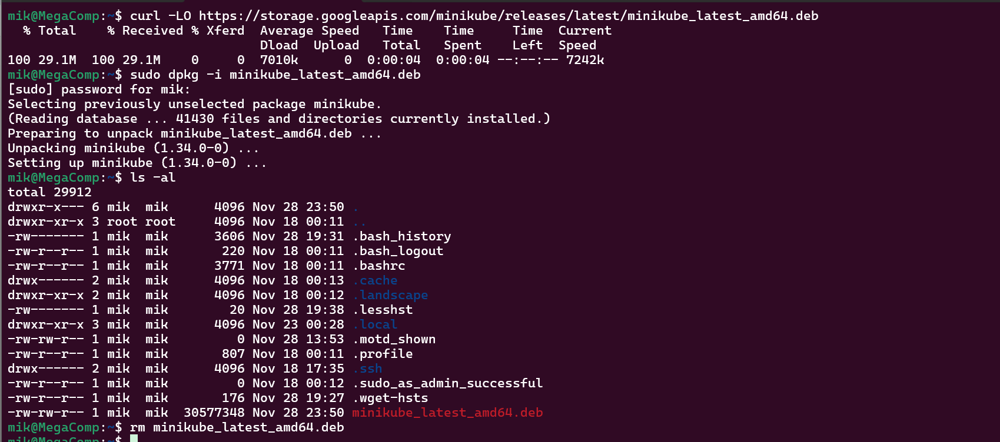
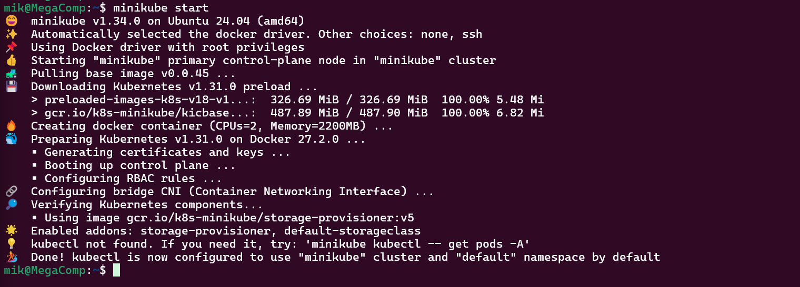
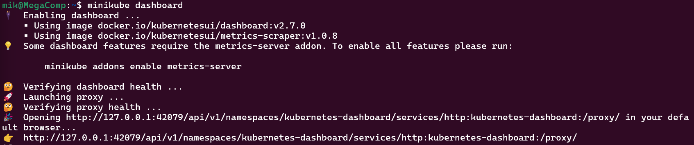
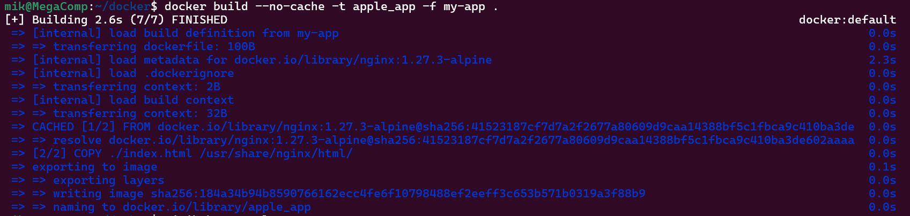
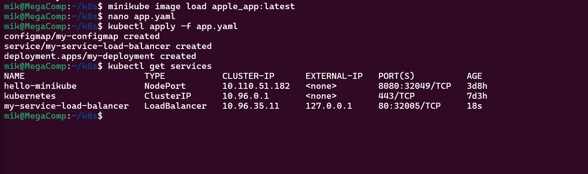
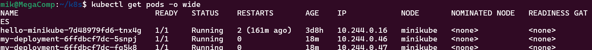
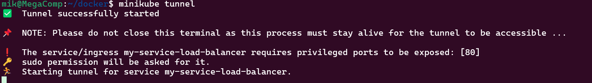
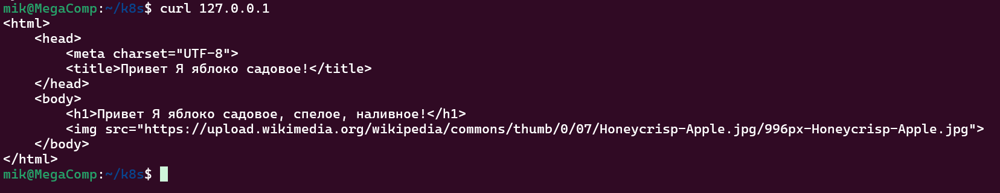

# Лабораторная работа №3

## Цели работы:
- Поднять kubernetes кластер локально (например minikube).
- Развернуть свой сервис, используя 2-3 ресурса kubernetes.


## Ход работы

### Установка Minikube.

Для работы с Minikube локально установим его на свою машину, в нашем случае это будет Ubuntu которая стоит на WSL. Для установки в случае Ubuntu скачаем deb пакет и установим его. В случае если ваша система отлична от Debian/Ubuntu посмотрите подходящий вам способ установки [на сайте](https://minikube.sigs.k8s.io/docs/start/).

```bash
curl -LO https://storage.googleapis.com/minikube/releases/latest/minikube_latest_amd64.deb
sudo dpkg -i minikube_latest_amd64.deb
rm minikube_latest_amd64.deb
``` 



Запускаем Minikube, выполнив команду minikube start. Видим что ему не хватает установленного kubectl



Устанавливаем версию kubectl необходимую для данного minikube и сразу же создаём alias в нашей системе, чтобы не писать каждый раз minikube kubectl.

```bash
minikube kubectl -- get po -A
alias kubectl="minikube kubectl --"
``` 



### Добавляем Docker контейнер в Minikube
Воспользуемся нашим хорошим образом, который мы приготовили в Лабораторной работе №2. Немного изменим его и  загрузим его в наш minikube, чтобы использовать его в pode.

1. Содержимое DockerFile у нас будет такое:
```bash
FROM nginx:1.27.3-alpine

COPY ./index.html /usr/share/nginx/html/
``` 

2. После необходимо создать сам образ и добавить его в Minikube
```bash
docker build --no-cache -t apple_app -f my-app .
minikube image load apple_app:latest
``` 



### Создание yaml файла с service, deployment и configmap

Создаём один yaml в файл в котором обьединим сразу 3 ресурса. Обращаю внимание что необходимо обязательно в контейнере использовать imagePullPolicy: Never, иначе кубер не будет пытаться взять образ локально, а будет искать его в DockerHub.

```bash
---
apiVersion: v1
kind: ConfigMap
metadata:
  name: my-configmap
data:
  default.conf: |
    server {
      listen 80 default_server;
      server_name  _;
      root /usr/share/nginx/html/;
      location / {
        try_files $uri $uri/ =404;
      }
    }
---
apiVersion: v1
kind: Service
metadata:
  name: my-service-load-balancer
spec:
  type: LoadBalancer
  ports:
    - port: 80
      targetPort: 80
  selector:
    app: my-app
---
apiVersion: apps/v1
kind: Deployment
metadata:
  name: my-deployment
spec:
  replicas: 2
  strategy:
    type: Recreate
  selector:
    matchLabels:
      app: my-app
  template:
    metadata:
      labels:
        app: my-app
    spec:
      containers:
        - name: app
          image: apple_app
          imagePullPolicy: Never
          ports:
            - containerPort: 80
          volumeMounts:
            - name: config
              mountPath: /etc/nginx/conf.d/
      volumes:
        - name: config
          configMap:
            name: my-configmap
``` 
### Проверка работы

1. Применим написанный манифест и посмотрим запустилиcь ли поды.

```bash
kubectl apply -f app.yaml
kubectl get pods -o wide
``` 



2. Для проверки работы приложения нам нужно получить EXTERNAL-IP для LoadBalancer. Для этого запустим tunnel на Minikube в отдельном окне терминала.

```bash
minikube tunnel
``` 


3. Чтобы посмотреть полученный EXTERNAL-IP для LoadBalancer необходимо проверить сервисы.

```bash
kubectl get services
``` 


4. Проверим работу приложения выполнил Curl запрос и зайдя на EXTERNAL-IP через браузер. В моём случае IP будет 127.0.0.1.

```bash
curl 127.0.0.1
``` 




## Итоги работы:
Научились устанавливать minikube, создавать кластеры, развертывать приложения в кластере и стали на шаг ближе к DevOps.