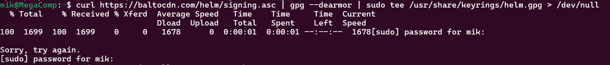
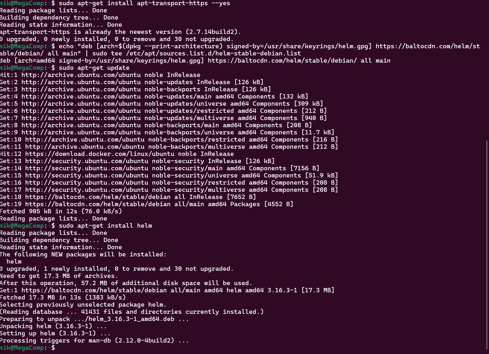
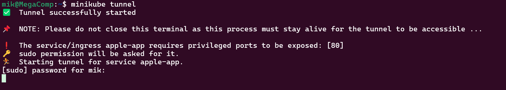
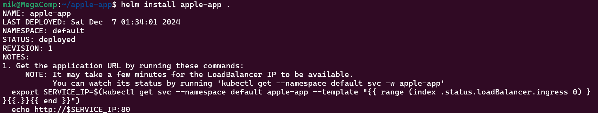
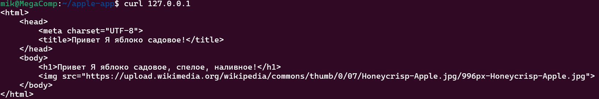
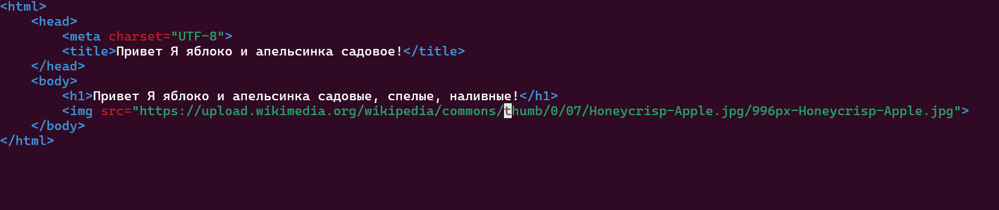
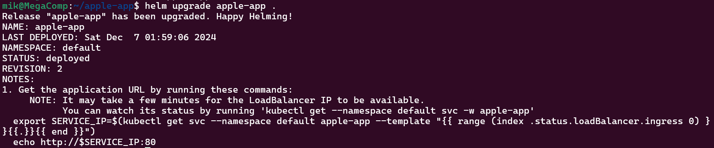
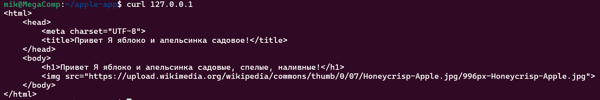

# Лабораторная работа №3 со звёздочкой

## Цели работы:
- Создать helm chart на основе обычной 3 лабы
- Задеплоить его в кластер
- Поменять что-то в сервисе, задеплоить новую версию при помощи апгрейда релиза
- В отчете приложить скрины всего процесса, все использованные файлы, а также привести три причины, по которым использовать хелм удобнее чем классический деплой через кубернетес манифесты


## Ход работы

### Установка Helm.

Для работы с Helm установим его для начала на нашу машину. Для установки на Debian/Ubuntu добавим репозиторий с helm и установим его. В случае если ваша система отлична от Debian/Ubuntu посмотрите подходящий вам способ установки [на сайте](https://helm.sh/docs/intro/install/).

```bash
curl https://baltocdn.com/helm/signing.asc | gpg --dearmor | sudo tee /usr/share/keyrings/helm.gpg > /dev/null
sudo apt-get install apt-transport-https --yes
echo "deb [arch=$(dpkg --print-architecture) signed-by=/usr/share/keyrings/helm.gpg] https://baltocdn.com/helm/stable/debian/ all main" | sudo tee /etc/apt/sources.list.d/helm-stable-debian.list
sudo apt-get update
sudo apt-get install helm
``` 





### Создаем YAML-манифест Helm-чарта

1. Создайте структуру чарта. Главное помнить, что использовать можно только строчные буквы, цифры, - и .

```bash
helm create apple-app
cd apple-app
``` 

2. Модернизируем файл values.yaml с параметрами которые могут изменяться. Файл Chart.yaml оставляем как есть. Чтобы не занимать кучу места, комментарии в файле values.yaml убрал здесь. Скорее всего тут есть ненужные нам строки, но мы пока маленькие и глупые и просто хотим, чтобы это работало.

```bash
replicaCount: 2

image:
  repository: apple_app
  pullPolicy: Never
  tag: "latest"

imagePullSecrets: []
nameOverride: ""
fullnameOverride: ""

serviceAccount:
  create: false
  name: ""

podAnnotations: {}
podLabels: {}

podSecurityContext: {}

securityContext: {}

service:
  type: LoadBalancer
  port: 80

ingress:
  enabled: false
  className: ""
  annotations: {}
  hosts:
    - host: chart-example.local
      paths:
        - path: /
          pathType: ImplementationSpecific
  tls: []

resources: {}

livenessProbe:
  httpGet:
    path: /
    port: http
readinessProbe:
  httpGet:
    path: /
    port: http

autoscaling:
  enabled: false
  minReplicas: 1
  maxReplicas: 100
  targetCPUUtilizationPercentage: 80

volumes: []

volumeMounts: []

nodeSelector: {}

tolerations: []

affinity: {}

config:
  defaultConf: |
    server {
      listen 80 default_server;
      server_name  _;
      root /usr/share/nginx/html/;
      location / {
        try_files $uri $uri/ =404;
      }
    }
``` 

3. Создаём в папке templates шаблон для configmap, которого нет изначально.

```bash
apiVersion: v1
kind: ConfigMap
metadata:
  name: {{ include "apple-app.fullname" . }}-configmap
data:
  default.conf: |
{{ .Values.config.defaultConf | indent 4 }}
``` 

4. Проверяем что у нас получилось и нет ли у нас явных ошибок. 

```bash
helm lint
``` 


5. Запускаем tunnel в Minikube в отдельном окне терминара.

```bash
minikube tunnel
``` 


6.  Инсталируем чарт Helm и проверяем через curl всё ли у нас работает.

```bash
helm install apple-app .
curl 127.0.0.1
``` 



### Изменяем наш сервис и деплоим изменения апгрейд релизом

1. Изменяем index.html нашего сервиса, теперь у нас не только яблочки, но и апельсинки.



2. Пересобираем наш образ приложения и копируем его в Minikube.

```bash
docker build --no-cache -t apple_app -f my-app .
minikube image load apple_app:latest
```

3. Делаем апгрейд релиза 

```bash
 helm upgrade apple-app .
```


4. Проверяем что у нас получилось с помощью Curl.



### Причины почему Heml удобнее чем классические кубернетес манифесты

1. При использовании Kubernetes манифестов каждый файл статичен. Если нужно развернуть одно и то же приложение с разными параметрами (например, для разных окружений), приходится дублировать и изменять файлы вручную. Это приводит к дублированию и возможным ошибкам.

2. Обновление приложения с использованием манифестов часто требует ручной замены ресурсов. Если что-то пошло не так, откатить изменения сложно и может потребоваться восстановление из резервной копии. Helm отслеживает все релизы через свою систему управления ревизиями.

3. Если приложение зависит от других сервисов (например, базы данных), нужно вручную добавлять манифесты для этих сервисов. Helm позволяет автоматически подтянуть и развернуть зависимости, прописанные в Chart.yaml.

## Итоги работы:
Научились устанавливать Helm, создавать Helm charts, развертывать приложения с помощью Helm и стали на шаг ближе к DevOps.