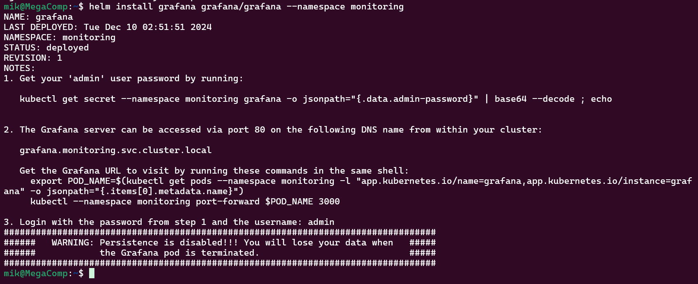
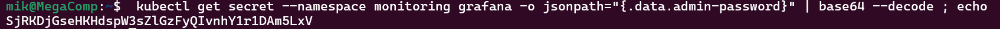

# Лабораторная работа №5

## Цели работы:
- Сделать мониторинг сервиса, поднятого в кубере (использовать, например, prometheus и grafana). Показать хотя бы два рабочих графика, которые будут отражать состояние системы. Приложить скриншоты всего процесса настройки.

## Ход работы

### Установка Helm.

Для работы с Helm установим его для начала на нашу машину. Для установки на Debian/Ubuntu добавим репозиторий с helm и установим его. В случае если ваша система отлична от Debian/Ubuntu посмотрите подходящий вам способ установки [на сайте](https://helm.sh/docs/intro/install/).

```bash
curl https://baltocdn.com/helm/signing.asc | gpg --dearmor | sudo tee /usr/share/keyrings/helm.gpg > /dev/null
sudo apt-get install apt-transport-https --yes
echo "deb [arch=$(dpkg --print-architecture) signed-by=/usr/share/keyrings/helm.gpg] https://baltocdn.com/helm/stable/debian/ all main" | sudo tee /etc/apt/sources.list.d/helm-stable-debian.list
sudo apt-get update
sudo apt-get install helm
``` 


### Установка Prometheus

1. Для начала добавим репозиторий Prometheus и обновим его.

```bash
helm repo add prometheus-community https://prometheus-community.github.io/helm-charts
helm repo update
``` 


2. Создадим namespace для мониторинга и установим в него Prometheus и проверим запустились ли поды. У меня лично поды запустились не с первого раза пришлось один раз удалить релиз prometheus и устанавливать по новой. Со второго раза все поды поднялись.

```bash
helm repo add prometheus-community https://prometheus-community.github.io/helm-charts
helm repo update
 kubectl get pods -n monitoring
``` 


### Пробрасываем доступ извне для Prometheus

1. Добавим в наш кластер новый сервис с типом LoadBalancer для Prometheus. Данный тип выбран потому что мы собираемся туннелировать трафик с minikube. Для открытия тунеля необходимо выполнить команду `minikube tunnel` в отдельной вкладке терминала.

```bash
 minikube kubectl -- expose service prometheus-server --namespace monitoring --type=LoadBalancer --port=8080 --target-port=9090 --name=prometheus-server-ext
```


2. Посмотрим какой EXTERNAL-IP мы получили и проверим, то что Prometheus стал доступен.

```bash
 minikube kubectl -- expose service prometheus-server --namespace monitoring --type=LoadBalancer --port=8081 --target-port=9090 --name=prometheus-server-ext
```


### Установка Grafana

1. Добавим репозиторий Grafana и устанавливаем её в пространство monitoring.

```bash
helm repo add grafana https://grafana.github.io/helm-charts
helm install grafana grafana/grafana --namespace monitoring
```




2. Получаем пароль от admin для доступа в интерфейс.

```bash
kubectl get secret --namespace monitoring grafana -o jsonpath="{.data.admin-password}" | base64 --decode ; echo
```


3. Пробрасываем порт для доступа в web интерфейс Grafana. Заходим внуть под admin с помощью пароля, который мы получили ранее.

```bash
kubectl port-forward -n monitoring svc/grafana 3002:80
```


### Настройка Grafana для работы с Prometheus

1. Необходимо добавить подгрузку данных с нашего Prometheus в Grafana. Для этого перейдём в `Connections->Data sources` и выберем Добавить новый источник данных. В качестве url Prometheus в учебных целях можно использовать внутренний IP сервера Prometheus в кластере. В нашем случае это `10.108.215.164`. Остальные данные можно оставить по умолчанию и нажимаем клавишу `Save & test`.


### Добавление дашбордов в Grafana

1. В меню выбираем `Dashboards` и далее нам необходим Импорт, потому что мы будем использовать уже готовый дашборд, а не создавать с нуля. В качестве добавляемых дашбордов будем использовать 15757 и 8171. В обоих случаях в качестве источника данных выбираем наш Prometheus, который мы настроили в прошлом шаге.


## Итоги работы:
Подняли мониторинг сервиса в кубере с помощью Prometheus и Grafana, посмотрели графики и стали на шаг ближе к DevOps.